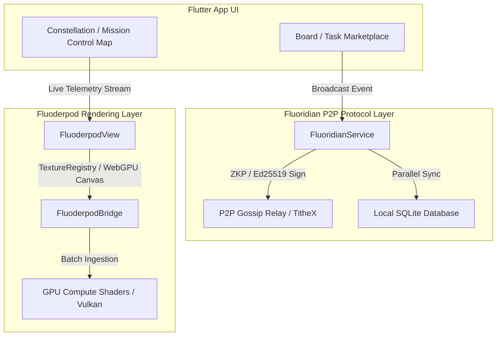

# Fluoridian & Fluoderpod Full Integration Plan

## 1. Executive Architecture Review

Based on the recent updates across the codebase:
- **Fluoridian (`FluoridianService`)**: Manages the decentralized P2P gossip network client (WebSocket TitheX protocol), ZKP/Ed25519 signing (`signAndBroadcast`), and parallel SQLite database persistence for tasks, bids, and faction wars.
- **Fluoderpod (`FluoderpodBridge` & `FluoderpodView`)**: Provides the high-throughput GPU rendering pipeline for AAA 3D graphics, targeting **Android Vulkan NDK surfaces** via JNI/FFI and **WebGPU** via Wasm/JS interop.

---

## 2. Integration Architecture Diagram

---

## 3. Step-by-Step Full Integration Roadmap

### Phase 1: Decentralized State & P2P Event Binding on the Board
- **Objective**: Wire up `localOfferingsProvider` and marketplace actions to `FluoridianService`.
- **Implementation**:
  - When a user posts a task (`CreateTaskPage`) or places a bid (`MakeOfferModal`), dispatch `FluoridianService.signAndBroadcast` with `NetworkEventType.taskCreated` or `NetworkEventType.marketplaceBid`.
  - Ingest incoming network gossip events into SQLite via `FluoridianService.ingestIncomingEvent` so the Board updates in real time across peers.

### Phase 2: Constellation & Mission Control 3D GPU Upgrade via Fluoderpod
- **Objective**: Replace standard 2D map overlays with `FluoderpodView` in `constellation_map_page.dart` and `game_map_overlay.dart`.
- **Implementation**:
  - Feed live node telemetry and friend positions from `fluoridianEventsStreamProvider` directly into `FluoderpodBridge.ingestBatch`.
  - Render active mesh nodes, squad blips, and territory controls as 3D instanced clusters on the GPU.

### Phase 3: Hardware Acceleration Pipeline (Android Vulkan & WebGPU)
- **Objective**: Bind `flutter_rust_bridge` to native `rust_lib_fluoridian_app` and `fluoderpod_render`.
- **Implementation**:
  - Link Android SurfaceTextures directly to Flutter's `Texture` widget via NDK Vulkan swapchain.
  - Enable WebGPU canvas context interop for high-framerate browser rendering.
