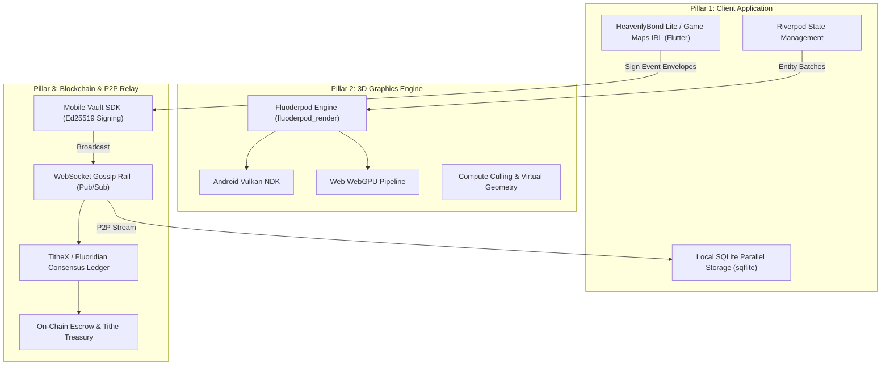

# HeavenlyBond Lite / Game Maps IRL - Final Completion Plan

## Target Platform Scope: Android and Web Only

> [!IMPORTANT]
> This project is exclusively targeted at **Android** and **Web**.
> * **Android:** Utilizes Flutter Android, Android NDK, and Vulkan hardware rendering via `fluoderpod_render` (`android_vulkan.rs`).
> * **Web:** Utilizes Flutter Web (CanvasKit / Wasm) and WebGPU via `wgpu`.
> * All native bridges, shader pipelines, and storage drivers must be built and validated exclusively for these two runtimes. iOS, macOS, and desktop native platforms are out of scope.

---

## 1. The Three Pillars Architecture Overview

To achieve a decentralized, offline-capable, and GPU-accelerated application, development is distributed across three distinct but deeply coupled pillars:

### Cross-Pillar Coordination Requirements
All agents working on this project must consult the tracking files of the corresponding pillar before implementing cross-cutting features:
1. **Pillar 1 Tracker:** [`AGENTS.md`](file:///c:/Users/blue-/projects/lite/AGENTS.md)
2. **Pillar 2 Tracker:** [`third_party/fluorescent/AGENTS.md`](file:///c:/Users/blue-/projects/lite/third_party/fluorescent/AGENTS.md)
3. **Pillar 3 Tracker:** [`third_party/fluorescent/third_party/tithX/AGENTS.md`](file:///c:/Users/blue-/projects/lite/third_party/fluorescent/third_party/tithX/AGENTS.md)

---

## 2. Pillar 1: Client Application Roadmap (HeavenlyBond Lite)

### Status & Scaffolded Assets

| Feature / Sprint | Scaffolded Component | Status | Key Remaining Work |
| :--- | :--- | :--- | :--- |
| **Sprint 2: Task Wizard** | `CreateTaskPage` (`lib/features/tasks/presentation/create_task_page.dart`) | Scaffolded | Connect GPS pin-drop map picker for Android & Web; wire direct photo uploads. |
| **Sprint 3: Bids & Offers** | `BidsPage` & `OfferDetailPage` (`lib/features/tasks/presentation/`) | Scaffolded | Connect creator counter-offer negotiation flow with Fluoridian escrow. |
| **Sprint 4: Verification** | `TaskVerificationPage` (`lib/features/tasks/presentation/task_verification_page.dart`) | Scaffolded | Capture camera evidence (`image_picker`), trigger smart contract escrow payout upon approval. |
| **Sprint 5: Credentials** | `CredentialsPage` (`lib/features/credentials/presentation/credentials_page.dart`) | In Progress | Implement document capture, DID attestation, and offer pre-requisite blocking. |
| **Sprint 6: Teams & Wars** | `TeamsPage` & `ConstellationMapPage` (`lib/features/teams/presentation/`) | In Progress | Enable submitting bids *on behalf of a team* and real-time war score replication. |
| **Sprint 7: Official Projects**| Project State Machine (`TASK` $\rightarrow$ `PROJECT`) | Backlog | Admin dashboard, multi-team role assignments (Security, Food, Logistics). |

---

## 3. Pillar 2: Fluoderpod GPU-Driven Render Engine

Located in [`third_party/fluorescent/fluoderpod_render`](file:///c:/Users/blue-/projects/lite/third_party/fluorescent/fluoderpod_render).

### Core Engine Tasks

1. **Compute Culling (`culling/mod.rs`):**
   * Implement compute shader frustum culling.
   * Implement Hierarchical Z-Buffer (HZB) occlusion culling to eliminate occluded geometry prior to rasterization.
2. **Virtual Geometry / Nanite-Style LOD (`virtual_geometry/mod.rs`):**
   * Implement continuous level-of-detail (LOD) cluster evaluation and GPU cluster streaming buffers.
3. **Unified Indirect Draw Pipeline (`unified_pipeline/mod.rs`):**
   * Transition command submission to multi-draw indirect command buffers via `wgpu`.
4. **Platform Targets:**
   * **Android:** Compile native cdylib using Android NDK (`android_vulkan.rs`) and link to Flutter Texture Registry via FFI.
   * **Web:** Compile to WebAssembly with WebGPU backend (`--target wasm32-unknown-unknown`).
5. **Riverpod $\leftrightarrow$ Fluoderpod Reactive Integration:**
   * Feed raw binary entity buffers via `FluoderpodBridge.ingestBatch()` from Riverpod location and task providers.
   * Replace Flutter CustomPaint mockups in `BoardPage`, `ConstellationMapPage`, and `GameMapOverlay` with `FluoderpodView`.

---

## 4. Pillar 3: TitheX / Fluoridian Blockchain & P2P Gossip

Located in [`third_party/fluorescent/third_party/tithX`](file:///c:/Users/blue-/projects/lite/third_party/fluorescent/third_party/tithX).

### Core Protocol Tasks

1. **Decentralized Event Envelope (`NetworkEvent`):**
   * Schema: `id` (hash), `did` (`did:nexus:...`), `eventType`, `payload`, `signature` (Ed25519), `createdAt`.
   * Model created in [`lib/core/blockchain/models/network_event.dart`](file:///c:/Users/blue-/projects/lite/lib/core/blockchain/models/network_event.dart).
2. **Mobile Vault SDK (`mobile-vault-sdk`):**
   * Android: Use Android Keystore / Secure Enclave for hardware Ed25519 signing.
   * Web: Use Web Crypto API (SubtleCrypto) for in-browser cryptographic signing.
3. **WebSocket Pub/Sub Gossip Relay:**
   * Connect `FluoridianService` ([`lib/core/blockchain/fluoridian_service.dart`](file:///c:/Users/blue-/projects/lite/lib/core/blockchain/fluoridian_service.dart)) to cluster nodes (`/execution-rail`).
   * Stream incoming events into local SQLite database (`sqflite`).
4. **On-Chain Escrow & Accounting:**
   * Enforce double-entry ledger invariants: 90% worker bounty held in escrow + 10% community tithe transferred to staking treasury.
   * Release escrowed funds upon receiving a signed `TASK_VERIFIED` event with `APPROVED` action.
5. **Proof of Health (PoH) Telemetry Daemon:**
   * Wire `RailMessage::Telemetry` in `nexus_client.rs` to report device compute availability.

---

## 5. Phased Execution Checklist

### Phase 1: Foundation & Compile Health (COMPLETED)
- [x] Fix Riverpod 3.0 migration errors in `game_provider.dart` (`Notifier` / `NotifierProvider`).
- [x] Fix Freezed abstract class declarations in `game_state.dart`.
- [x] Clean zero-error compilation on `lib/features/game`.
- [x] Update `AGENTS.md` with Android/Web target constraint and cross-pillar links.

### Phase 2: Scaffold Core Workflows (COMPLETED)
- [x] Scaffold 5-step `CreateTaskPage` wizard.
- [x] Scaffold dedicated `BidsPage` and `OfferDetailPage`.
- [x] Scaffold `TaskVerificationPage` for proof-of-work submission & review.
- [x] Implement `NetworkEvent` envelope model.
- [x] Implement `FluoridianService` for P2P gossip & SQLite sync.
- [x] Implement `FluoderpodBridge` and universal `FluoderpodView` widget.
- [x] Wire all routes into `router.dart` and add Post Task FAB to `BoardPage`.

### Phase 3: Android & Web Hardening (NEXT STEPS)
- [ ] Test Android APK build (`flutter build apk --debug`).
- [ ] Test Web build (`flutter build web --wasm`).
- [ ] Connect `FluoderpodBridge` to native Vulkan surface on Android and WebGPU canvas on Web.
- [ ] Connect live WebSocket gossip rail to `FluoridianService`.
- [ ] Conduct end-to-end task creation $\rightarrow$ bidding $\rightarrow$ verification $\rightarrow$ escrow release cycle.
