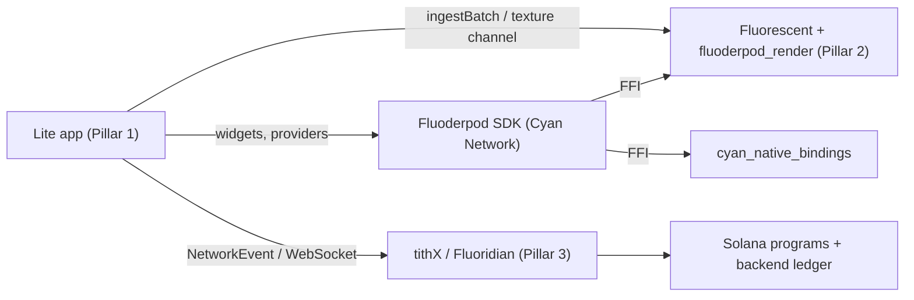
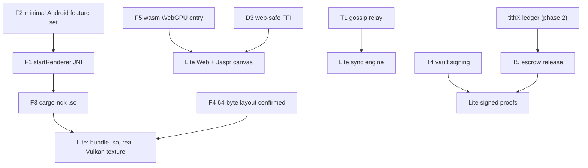

# Dependency Team Breakdown: What Each Team Must Build

Sources: `third_party/tithX/{AGENTS,MULTI_AGENT_PLAN,REMAINING_TASKS}.md`, `third_party/fluorescent/{AGENTS,REMAINING_WORK_MULTI_AGENT_PLAN}.md`, `third_party/fluoderpod/README.md`, `fluoderpod_render/Cargo.toml`, and the Lite codebase. Items marked **(inferred)** are my reading of the code, not something a team's own plan states.

---

## 1. Fluorescent team (`third_party/fluorescent`, crate `fluoderpod_render`)

**Owns the GPU renderer. Blocks Lite UPGRADE-03 and UPGRADE-04.**

### 1a. Needed for Lite upgrades (critical path)

| # | Deliverable | Where | Detail | Unblocks |
| :-- | :--- | :--- | :--- | :--- |
| F1 | Android `startRenderer` / `stopRenderer` JNI | `src/android_vulkan.rs` | Signatures fixed by Lite's Kotlin: `Java_com_fluorescent_vulkan_FluorescentVulkanPlugin_startRenderer(env, class, window: jlong, w: jint, h: jint) -> jboolean` and `..._stopRenderer(env, class, window: jlong)`. Create a wgpu Vulkan instance, build a surface from the `ANativeWindow`, configure it, run a loop driving `FluoderpodRenderer::execute_frame`. Release the window on stop. | UPGRADE-03 |
| F2 | Minimal Android feature set | `Cargo.toml` | `webrtc`, `openxr`, `reticulum`, `tokio-tungstenite` are unconditional on non-wasm. Put them behind features so `--no-default-features --features android-render` builds only wgpu, jni, ndk. Confirm `wgpu 0.20` + `wgpu-hal 0.21.1` versions are mutually compatible **(inferred: they look mismatched)**. | UPGRADE-03 |
| F3 | Android build recipe + CI | repo root | `rustup target add aarch64-linux-android armv7-linux-androideabi x86_64-linux-android`, `cargo ndk ... -o <lite>/android/app/src/main/jniLibs build --release`. Publish prebuilt `.so` artifacts so Lite does not need a Rust toolchain. | UPGRADE-03 |
| F4 | Entity layout contract | `src/lib.rs` (`ingest_fluoderpod_batch`, line ~88; FFI `fluoderpod_ingest_batch`) | Lite sends **64-byte little-endian packets** (offsets in `UPGRADE_01_RIVERPOD_STREAMER.md`). Confirm the Rust struct matches byte for byte, reject lengths not divisible by 64, and document it. | UPGRADE-01 end-to-end |
| F5 | wasm32 + WebGPU build | `Cargo.toml`, `src/lib.rs` | No `webgpu` cargo feature exists today. Add a `wasm-bindgen` entry point that takes a canvas id, creates a wgpu surface from `HtmlCanvasElement`, and renders. Must run without panicking when browser APIs are missing. | UPGRADE-04 |
| F6 | Frame-rate control hook | `src/thermal/mod.rs`, `set_scene_activity` | Lite's bridge computes 60/24 FPS tiers. Expose a way for the host to set a target FPS or idle flag so renderer and host agree. | UPGRADE-05 |

### 1b. Their own engine backlog (from `REMAINING_WORK_MULTI_AGENT_PLAN.md`)

1. **Rendering Architect:** `advanced_lighting/vsm.rs` (physical pages, page tables, shadow dispatch); `fluorite_core/.../rtgi.rs` (ray trace against TLAS, spherical-harmonic probes); `dlss.rs` (TAA/FSR2 upscaling).
2. **Systems & Gameplay:** `animation/ik.rs` (`solve_two_bone_ik`, `solve_fabrik`); `physics/destruction/mod.rs` (Voronoi fracture, Rapier3D bodies).
3. **World Streaming & PCG:** `streaming/pcg/mod.rs` `generate_chunk` (noise heightmaps, vegetation entities).
4. **Networking & Cloud:** `net/replication.rs` interpolation/extrapolation and server-side culling in `get_visible_entities`.
5. **UI/UX & Mobile:** `examples/functional_test_app/lib/geofencing.dart` and `background_location.dart`.
6. **Tools & Editor:** `fluorite_editor/.../serialization.dart` mapping PCG/VFX nodes to render-graph JSON.
7. **Priority fixes in `AGENTS.md`:** HZB occlusion culling (`culling/mod.rs`), Nanite-style cluster LOD (`virtual_geometry/mod.rs`), thermal scaling.

> [!NOTE]
> Items 1.2 to 1.6 serve the broader engine; Lite does not need them for its current roadmap. Culling and cluster LOD (item 7) matter once Lite streams thousands of entities.

---

## 2. Fluoderpod SDK team (`third_party/fluoderpod`)

Two packages: `fluoderpod/` (Flutter/Dart SDK: Riverpod 3.x, Tactical HUD, globe views, FFI wrappers, `CyanDashboard`) and `cyan_native_bindings/` (Rust cdylib: OpenXR, Android Auto, game controllers).

| # | Deliverable | Detail |
| :-- | :--- | :--- |
| D1 | **Decide who owns the texture bridge.** | Lite currently has its own `FluoderpodBridge` + Kotlin plugin. The SDK should either adopt that channel contract (`com.fluorescent.vulkan/texture`: `start`, `resize`, `dispose`, returns `{textureId}`) or ship its own and Lite deletes its copy. Two bridges will conflict. |
| D2 | Entity ingest API | Dart wrapper over `fluoderpod_ingest_batch` taking `Uint8List` in the 64-byte layout, plus an `EntityPacketEncoder` so apps do not each reimplement it. Lite's encoder in `lib/core/fluoderpod/entity_packet_encoder.dart` can be upstreamed. |
| D3 | Web-safe FFI | `dart:ffi` does not exist on Web. SDK needs conditional imports with a web implementation (Wasm via `dart:js_interop`/`package:web`) and a stub. Lite targets Android + Web only, so both must work. |
| D4 | Graceful degradation | Public `isNativeAvailable` signal; widgets (`CyanDashboard`) must render usable fallbacks when the `.so`/Wasm is absent, so apps never show an empty texture. |
| D5 | Platform scope | Remove or isolate iOS/macOS/desktop code paths from the dependency graph so Android/Web builds stay clean (Lite's APK already builds, but verify after D3). |
| D6 | `cyan_native_bindings` for Android | Build cdylib for the three Android ABIs; OpenXR and Android Auto are the relevant pieces. Controllers are optional for Lite. |
| D7 | Version hygiene | Lite is on `flutter_riverpod ^3.0.0` and `freezed ^4`. SDK must stay compatible and use `abstract class` + `@freezed`. |
| D8 | Tests | `flutter test` in `fluoderpod/` and `cargo test` in `cyan_native_bindings/` (their README). Add contract tests for the packet layout. |

---

## 3. tithX / Fluoridian team (`third_party/tithX`)

Governing rule from their `AGENTS.md`: **the internal double-entry ledger is the source of truth, not the blockchain**; users must not need to understand blockchain.

### Needed for Lite

| # | Deliverable | Detail | Lite feature |
| :-- | :--- | :--- | :--- |
| T1 | WebSocket pub/sub gossip relay | Topic subscribe (e.g. `topic:bids:plumbing`), relay `NetworkEvent` envelopes `{id, did, eventType, payload, signature, createdAt}`, validate Ed25519 signature against DID. Fix hardcoded secrets in `signaling_node` first. | Offline sync, bids, tasks |
| T2 | Event schema stability | Publish the allowed `eventType` values (`TASK_CREATED`, `MARKETPLACE_BID`, `TASK_VERIFIED`, ...) and payload JSON schemas so Lite's SQLite hydration does not break. | Sync engine |
| T3 | DID resolution | Ledger/API mapping `did:nexus:...` to public keys. | Signature verification |
| T4 | `mobile-vault-sdk` | Ed25519 signing: Android Keystore on Android, Web Crypto (SubtleCrypto) on Web, exposed to Dart (via `flutter_rust_bridge` or Dart-only on Web). | Signed completion proofs |
| T5 | Escrow release on `TASK_VERIFIED` | 90% worker bounty escrowed + 10% tithe to treasury; release on a signed `TASK_VERIFIED`/`APPROVED` event. | Verification page payout |
| T6 | Jaspr client | `fluoridian_jaspr_client` is the pure-Dart web client. Needs the WebGPU canvas component (UPGRADE-04) and a shared `NetworkEvent` model package with Lite. Already builds with `jaspr build`. | Web |
| T7 | PoH telemetry | Wire `RailMessage::Telemetry` in `nexus_client.rs`. | Future |

### Their own V1 backlog (from `REMAINING_TASKS.md` and `MULTI_AGENT_PLAN.md`)

| Agent | Tasks |
| :--- | :--- |
| `db-backend-agent` | Sync Prisma schema (6 of 17 models); write ledger service (`backend/src/services/ledger.js`) so every mutation is a balanced `LedgerTransaction`; tithe engine (10% of stake), platform balance, subscription periods/renewal, withdrawal settlement; connect fiat webhook to ledger events. |
| `api-agent` | Replace `501` stubs in `api/src/lib.rs`; emit `FluoridianEvent` (`USER_CREATED`, `PAYMENT_RECEIVED`, `TITHE_CALCULATED`); 9 of 13 marketplace API domains missing. |
| `solana-agent` | Migrate TITHE to Token-2022; staking-to-governance CPI for `stake_power`; treasury multi-sig + timelock; DAO lifecycle (abstain, expiration, finalize, execute); mint validation on stake vault. |
| `sdk-agent` | `fluoridian-sdk` is **Not Started**: typed Rust client, Agave 4.x migration, `no-std`, RPC on a background worker (`tokio` + `async-channel`). |
| `flutter-agent` | `fluoridian_app/`: staking, subscriptions, governance, treasury, marketplace screens. |
| `security-agent` | Remove hardcoded secrets, audit invariants, migrate `execution-rail` from `raft` 0.7.0 to `openraft`. |
| Network | Gossip congestion/pruning (Bloom filters), DTN bundle cache, ETX/Doppler path metric, DID/Ed25519 mesh handshakes. |

> [!WARNING]
> Phases 2, 6, 7, 8 and 15 (ledger, $1 subscription, tithe, platform balance, withdrawals) are marked **Not Implemented**. Lite's escrow flow (T5) depends on them, so escrow settlement cannot be completed until the ledger exists.

---

## 4. Lite team (this repo)

| Status | Item |
| :--- | :--- |
| Done | UPGRADE-01 encoder, provider, tests; UPGRADE-02 Local tab viewport; UPGRADE-05 throttler logic; Android texture plugin + bridge fallback (UPGRADE-03 plumbing). |
| Open | Run `tick()` in a render loop and call `setPaused()` from app lifecycle; stream players/guild hubs, not only tasks; board viewport gestures (pan/zoom) forwarded to the engine. |
| Open | Sync engine: hydrate SQLite from `NetworkEvent`s; offline queue for tasks/bids. |
| Open | Wizard GPS pin-drop and category tags; verification page camera capture, SHA-256 hash, signed proof. |
| Open | Wasm build check (`flutter build web --wasm`); `build.yaml` filters; migrate critical providers off codegen. |
| Cleanup | Several `lib/` files showed mojibake earlier; re-check any file edited by scripts for encoding. |

---

## 5. Critical path and contracts

**Contracts every team must agree on in writing**

1. **Entity packet:** 64 bytes, little-endian, layout as in UPGRADE-01. Owner: Fluorescent. Consumers: Fluoderpod SDK, Lite.
2. **Texture channel:** `com.fluorescent.vulkan/texture` methods and error codes (`NATIVE_UNAVAILABLE`, `NO_WINDOW`, `RENDERER_FAILED`). Owner: decide in D1.
3. **JNI symbols:** names above are fixed; renaming the Kotlin package breaks them.
4. **`NetworkEvent` schema and `eventType` list.** Owner: tithX. Consumer: Lite, Jaspr client.
5. **Signing:** which bytes are signed (canonical JSON of `payload`?) and the DID format. Owner: tithX `mobile-vault-sdk`.

## 6. Open decisions for you

1. Who owns the Android texture bridge: Lite's plugin or the Fluoderpod SDK (D1)?  the Fluoderpod SDK
2. Web/JS policy: `wasm-bindgen` and Flutter Web both emit JS glue. Your no-JS/TS rule can hold for **authored** code (Dart + Rust only), but generated glue cannot be avoided. Is that acceptable? yes, to be using jaaspr.js for web
3. Should Lite wait on the tithX ledger (phases 2 to 8) before building escrow UI, or mock settlement for now? mock settlement for now
