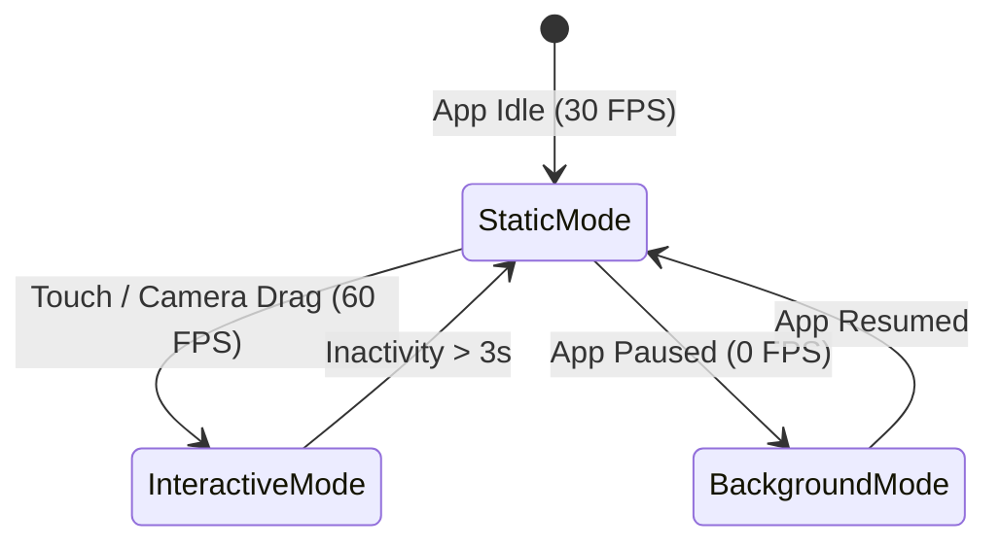

# UPGRADE-05: Real-Time Spatial VFX & Thermal Throttler
**Agent Role:** Agent Theta (Engine Simulation & Power Specialist)  
**Target Scope:** Android & Web  
**Objective:** Add cyberpunk / holographic cyan visual effects, volumetric mission markers, and battery-friendly thermal scaling to prevent overheating on mobile devices.

---

## 1. Technical Specification

### 1.1 VFX Pipeline
* **Volumetric Task Pillars:** Vertical cyan energy beacons shooting up into the sky at task GPS locations. Brightness and pulse frequency scale with bounty amount.
* **Faction Territory Shaders:** Ground plane procedural hex-grid highlighting faction control (Cyan vs Gold).
* **Scanline & Chromatic Aberration:** Lightweight post-process passes applied directly in GPU swapchain.

### 1.2 Thermal & Battery Scaling State Machine
To conserve mobile battery:
* **Interactive Mode (60 FPS):** Active touch gestures, map dragging, camera panning, or active combat turn.
* **Static Read Mode (15–30 FPS):** User is reading a task description card, inspecting an offer, or viewing text feeds.
* **Background Idle Mode (0–1 FPS / Paused):** App minimized or screen occluded by full-screen modal.



---

## 2. Step-by-Step Implementation Instructions

### Step 1: Implement Dynamic FPS Throttling in `FluoderpodBridge`
Add an activity watchdog in `lib/core/fluoderpod/fluoderpod_bridge.dart`:
```dart
void notifyUserInteraction() {
  _lastInteractionTime = DateTime.now();
  _targetFps = 60.0;
}

void tick() {
  if (DateTime.now().difference(_lastInteractionTime).inSeconds > 3) {
    _targetFps = 24.0; // Conserve mobile GPU battery
  }
}
```

### Step 2: WGSL Holographic Shader Pass
Add `assets/shaders/hologram_beacon.wgsl` for volumetric pillars and compile to SPIR-V for Vulkan and WGSL for WebGPU.

---

## 3. Build & Verification Commands

```powershell
# 1. Profile frame rate and thermal behavior on Android
flutter run --profile -d <android-device-id>

# 2. Verify static analysis
flutter analyze lib/core/fluoderpod
```
