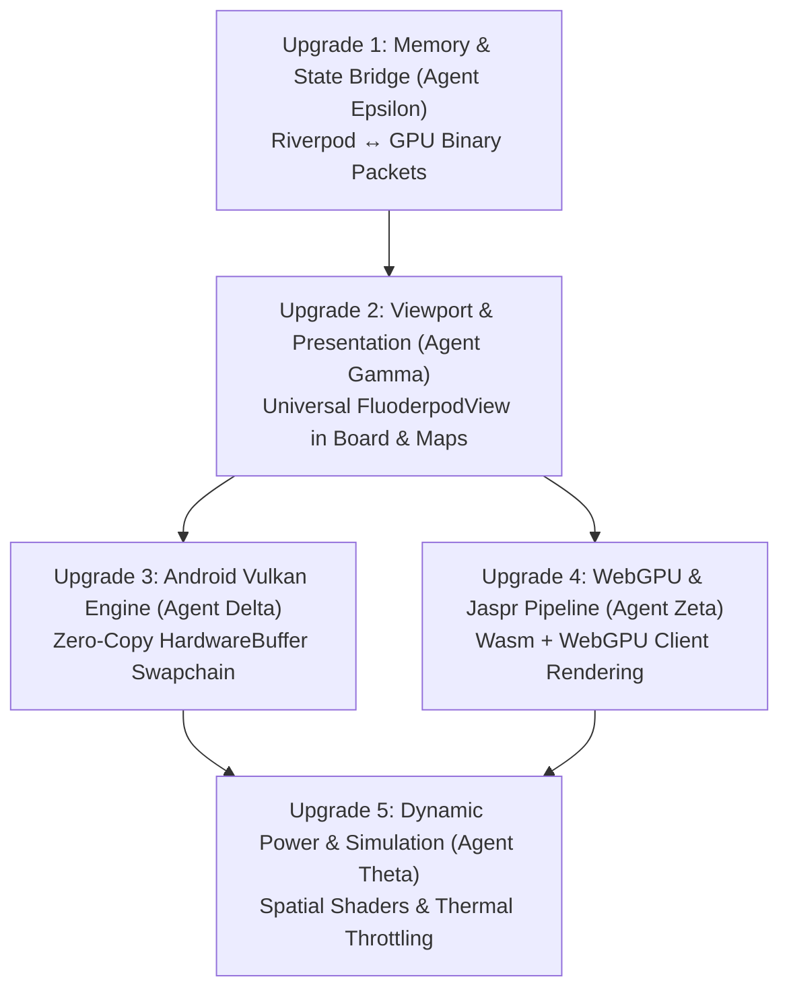

# Multi-Agent Fluoderpod Upgrade Master Plan & Build Directives
**Target Ecosystem:** Android (Vulkan NDK / HardwareBuffer) & Web (Wasm / WebGPU / Jaspr)  
**Strict Policy:** No iOS/Desktop scope. Zero JS/TS runtime code for web (use Jaspr / Dart-Wasm).

---

## 1. Executive Summary

This plan breaks down the end-to-end integration of the **Fluoderpod 3D GPU-driven rendering engine** across HeavenlyBond Lite / Game Maps IRL into discrete, independently buildable, and verifiable upgrades.

Each upgrade is assigned to a specialized agent role with concrete deliverables, code targets, and strict build validation commands.

---

## 2. Multi-Agent Roles & Upgrade Matrix

| Upgrade ID | Title & Pillar Focus | Lead Agent | Scope | Target Platforms | Key Verification Command |
| :--- | :--- | :--- | :--- | :--- | :--- |
| **UPGRADE-01** | High-Throughput Riverpod Binary Streamer | **Agent Epsilon** (Systems & State) | `lib/core/fluoderpod/fluoderpod_bridge.dart` | Android & Web | `flutter test test/core/fluoderpod_stream_test.dart` |
| **UPGRADE-02** | Universal 3D Viewport Replacement | **Agent Gamma** (UI / Integration) | `lib/features/board/`, `lib/features/mission_control/` | Android & Web | `flutter analyze lib/features/board lib/features/mission_control` |
| **UPGRADE-03** | Android Vulkan HardwareBuffer Zero-Copy Bridge | **Agent Delta** (Native NDK / Vulkan) | `third_party/fluorescent/fluoderpod_render/src/android_vulkan.rs` | Android NDK | `flutter build apk --release` |
| **UPGRADE-04** | WebGPU & Jaspr CanvasKit Interop | **Agent Zeta** (Web / Wasm) | `third_party/fluorescent/fluoderpod_render/` & Jaspr client | Web (Wasm) | `flutter build web --wasm` |
| **UPGRADE-05** | Real-Time Spatial VFX & Thermal Throttler | **Agent Theta** (Simulation / Engine) | `lib/core/fluoderpod/fluoderpod_view.dart` & WGSL Shaders | Android & Web | `flutter run --profile` |

---

## 3. Detailed Upgrade Specifications

### UPGRADE-01: High-Throughput Riverpod Binary Streamer
* **Goal:** Completely eliminate CPU widget tree recreation when map pins, players, or task bounties change. Stream packed 64-byte binary structs directly into `FluoderpodBridge.ingestBatch()`.
* **Lead Agent:** Agent Epsilon
* **Documentation & Build Guide:** [`docs/upgrades/UPGRADE_01_RIVERPOD_STREAMER.md`](file:///c:/Users/blue-/projects/lite/docs/upgrades/UPGRADE_01_RIVERPOD_STREAMER.md)

### UPGRADE-02: Universal 3D Viewport Replacement
* **Goal:** Replace legacy custom painters and placeholder tabs across `BoardPage`, `ConstellationMapPage`, and `GameMapOverlay` with the reactive `FluoderpodView`.
* **Lead Agent:** Agent Gamma
* **Documentation & Build Guide:** [`docs/upgrades/UPGRADE_02_UNIVERSAL_VIEWPORTS.md`](file:///c:/Users/blue-/projects/lite/docs/upgrades/UPGRADE_02_UNIVERSAL_VIEWPORTS.md)

### UPGRADE-03: Android Vulkan HardwareBuffer Zero-Copy Bridge
* **Goal:** Eliminate CPU frame read-backs in Android release builds. Link Vulkan swapchains directly to Flutter Texture Registry via `AHardwareBuffer` / `ANativeWindow`.
* **Lead Agent:** Agent Delta
* **Documentation & Build Guide:** [`docs/upgrades/UPGRADE_03_ANDROID_VULKAN_BRIDGE.md`](file:///c:/Users/blue-/projects/lite/docs/upgrades/UPGRADE_03_ANDROID_VULKAN_BRIDGE.md)

### UPGRADE-04: WebGPU & Jaspr CanvasKit Interop
* **Goal:** Bring pure Dart/Wasm 3D hardware acceleration to Flutter Web and the `fluoridian_jaspr_client`, eliminating JavaScript/TypeScript entirely.
* **Lead Agent:** Agent Zeta
* **Documentation & Build Guide:** [`docs/upgrades/UPGRADE_04_WEBGPU_JASPR_PIPELINE.md`](file:///c:/Users/blue-/projects/lite/docs/upgrades/UPGRADE_04_WEBGPU_JASPR_PIPELINE.md)

### UPGRADE-05: Real-Time Spatial VFX & Thermal Throttler
* **Goal:** Add holographic cyan visual effects, volumetric task markers, and battery-friendly FPS throttling (15 FPS static idle $\leftrightarrow$ 60 FPS interactive).
* **Lead Agent:** Agent Theta
* **Documentation & Build Guide:** [`docs/upgrades/UPGRADE_05_VFX_AND_THERMAL.md`](file:///c:/Users/blue-/projects/lite/docs/upgrades/UPGRADE_05_VFX_AND_THERMAL.md)
